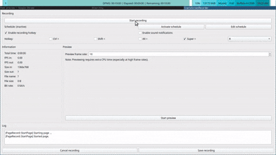

# peek.nvim

A Markdown previewer for Neovim — not a dead-end, but a navigation surface.

Read rendered Markdown, jump between headings, browse nearby files,
and load them into a Neovim buffer the moment editing is needed.



### Why?

Sometimes I edit Markdown while checking the rendered preview.
Sometimes I just want to read Markdown as a document.

But while reading, I often find something I want to edit immediately.

This feature makes the preview window a lightweight navigation surface:
read rendered Markdown, jump between headings, browse nearby Markdown files,
and load them directly into a Neovim buffer — one click away from editing.

This fork adds a lightweight bridge between Markdown viewing and Neovim editing:

- Table of Contents in the preview window
- Markdown File Explorer
- Open Markdown files directly into a Neovim buffer
- Viewer tabs synchronized with Neovim tabs
- Click rendered blocks to return to their source
- Safe routing for fragments, Markdown files, and external links
- Disabled by default

### :sparkles: Features

- live update
- synchronized scrolling
- github-style look
- [TeX](https://github.com/KaTeX/KaTeX) math
- [Mermaid](https://github.com/mermaid-js/mermaid) diagrams
- sidebar with table of contents and file explorer (`useful_web = true`)
- synchronized Markdown tabs in the preview (`useful_web = true`)
- click-to-source navigation (`useful_web = true`)
- routed Markdown and external links (`useful_web = true`)

### :battery: Requirements

- [Deno](https://deno.land)

### :electric_plug: Installation

##### lazy.nvim

```lua
{
    "mizuirorivi/peek.nvim",
    event = { "VeryLazy" },
    build = "deno task --quiet build:fast",
    config = function()
        require("peek").setup({
            useful_web = true,  -- enable sidebar (table of contents + file explorer)
            tab = false,        -- fallback for clients without the open-location picker
            sync_scroll_from_browser = true,
        })
        vim.api.nvim_create_user_command("PeekOpen", require("peek").open, {})
        vim.api.nvim_create_user_command("PeekClose", require("peek").close, {})
        vim.api.nvim_create_user_command("PeekSyncTabs", require("peek").sync_tabs, {})
    end,
},
```

### :wrench: Configuration

```lua
-- default config:
require('peek').setup({
  auto_load = true,         -- whether to automatically load preview when
                            -- entering another markdown buffer
  close_on_bdelete = true,  -- close preview window on buffer delete

  syntax = true,            -- enable syntax highlighting, affects performance

  theme = 'dark',           -- 'dark' or 'light'

  update_on_change = true,

  sync_scroll_from_browser = false, -- move the Neovim cursor as the preview scrolls

  app = 'webview',          -- 'webview', 'browser', string or a table of strings
                            -- explained below

  filetype = { 'markdown' },-- list of filetypes to recognize as markdown

  -- relevant if update_on_change is true
  throttle_at = 200000,     -- start throttling when file exceeds this
                            -- amount of bytes in size
  throttle_time = 'auto',   -- minimum amount of time in milliseconds
                            -- that has to pass before starting new render

  useful_web = false,       -- enable sidebar UI (table of contents + file explorer)

  tab = false,              -- fallback when a file-open request omits its target
                            -- (requires useful_web = true)
})
```

### :paperclip: `app` option

Preview opens in a [webview](https://github.com/webview/webview_deno) window by default.
You can set this option to `'browser'` (will use your default browser as previewer) or
specify browser along with arguments:

`app = 'chromium'`

`app = { 'chromium', '--new-window' }`

[Chromium based browser](https://en.wikipedia.org/wiki/Chromium_(web_browser)#Browsers_based_on_Chromium) is recommended.

### :bulb: Usage

| method ||
|-|-|
| open    | Open preview window                                 |
| close   | Close preview window                                |
| is_open | Returns `true` if preview window is currently open  |
| sync_tabs | Resend Neovim's Markdown tabs to the preview      |

Example command setup:

```lua
vim.api.nvim_create_user_command('PeekOpen', require('peek').open, {})
vim.api.nvim_create_user_command('PeekClose', require('peek').close, {})
vim.api.nvim_create_user_command('PeekSyncTabs', require('peek').sync_tabs, {})
```

The following keybinds are active when preview window is focused:

| key ||
|-|-|
| k | scroll up               |
| j | scroll down             |
| u | scroll up half a page   |
| d | scroll down half a page |
| g | scroll to top           |
| G | scroll to bottom        |

### :left_right_arrow: Bidirectional scrolling

Neovim cursor movement scrolls the preview by default. To also move the Neovim
cursor when scrolling the preview, enable `sync_scroll_from_browser`:

```lua
require('peek').setup({
  sync_scroll_from_browser = true,
})
```

The source line at the center of the preview is sent to Neovim while scrolling.
Neovim moves the cursor to that line and centers it in the originating window.

### :books: Sidebar (`useful_web = true`)

Enable the sidebar UI with `useful_web = true` in your setup call.

Two panels are available, toggled by buttons in the top-left corner of the preview window:

| panel | description |
|-|-|
| Table of Contents | Lists all headings in the current document. Click to scroll to that heading. |
| File Explorer     | Directory tree rooted at the current file's parent. Click a `.md` file to choose where to open it. |

The file explorer supports recursive directory expansion. Click `↑ ../` at the top of the
panel to navigate to the parent directory. Opening a panel pushes the markdown content
to the right instead of overlaying it.

Clicking a Markdown file opens a compact action picker. Choose `>` to replace the buffer
in the current Neovim tab or `+` to always open the file in a new tab.

The tab bar above the preview mirrors Neovim tabs displaying Markdown files. Selecting a
preview tab focuses the corresponding Neovim tab. Switching or closing tabs in Neovim
updates the preview tab bar; tabs are closed from Neovim rather than from the preview.
Run `:PeekSyncTabs` to manually resend the current Neovim tab state when needed.

Click non-interactive rendered content to make its source window current in Neovim and
move the cursor to the beginning of that source block. Links, controls, modified clicks,
and text selection keep their normal browser behavior.

Links are routed without replacing the preview page:

| target | behavior |
|-|-|
| Same-document fragment | Scroll to the target every time it is activated. |
| Relative or absolute Markdown file | Choose `>` or `+`; modified and middle clicks use `+`. |
| HTTP(S), `mailto:`, or `tel:` | Open in a browser tab or with the system handler. |
| Missing, unsafe, or local non-Markdown target | Block and show a status message. |

Link routing is disabled together with the rest of the navigation UI when
`useful_web = false`.

### :mag: Preview window

Use your window manager to set preview window properties. Window title is `Peek preview`.

**[i3wm](https://i3wm.org/) examples:**

```
# do not focus preview window on open
no_focus [title="^Peek preview$"]
```

Use `i3-msg` to manipulate current layout and open preview window at desired position:

```lua
local peek = require('peek')

vim.api.nvim_create_user_command('PeekOpen', function()
  if not peek.is_open() and vim.bo[vim.api.nvim_get_current_buf()].filetype == 'markdown' then
    vim.fn.system('i3-msg split horizontal')
    peek.open()
  end
end, {})

vim.api.nvim_create_user_command('PeekClose', function()
  if peek.is_open() then
    peek.close()
    vim.fn.system('i3-msg move left')
  end
end, {})
```
